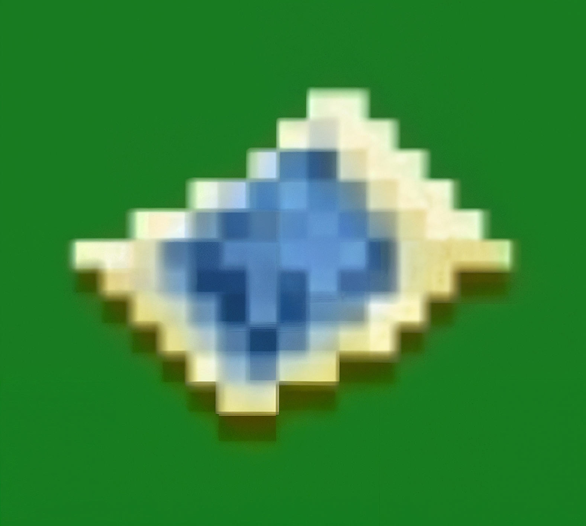

  

ImageMap Android

An Android tool for converting images into Minecraft Bedrock map art.

ImageMap Android works with Minecraft Bedrock world data to generate map art from an image.

Download

Download the latest APK from the Releases section of this repository.

Requirements

- Android device
- Minecraft Bedrock Edition
- A Minecraft Bedrock world
- Sufficient storage and memory for the selected map-art size

How to Use

1. Create a folder named "Image Map" inside your Downloads folder.
2. Copy or move the Minecraft world you want to use into "Downloads/Image Map/".
3. Open ImageMap Android.
4. Use the world picker to navigate to "Downloads/Image Map/".
5. Select the actual world folder, not the "Image Map" parent folder.
6. Select the image you want to convert.
7. Choose your map-art settings.
8. Generate the map art.
9. After generating map art, move the world folder back to the appropriate Minecraft worlds directory.
10. Open the world in Minecraft.

⚠️ Important

Back up your world before using the app.

The app works directly with world data, so keeping a backup is strongly recommended.

Map-Art Size & Performance

ImageMap Android does not impose a fixed maximum map-art size.

However, this does not mean that extremely large map arts, such as hundreds or thousands of maps—or hundreds of thousands of maps—can be generated without performance issues.

Larger map-art dimensions require significantly more:

- Processing time
- Memory
- Storage
- Device resources

Very large map arts may cause:

- Long processing times
- High memory usage
- Temporary freezing
- Android terminating the application
- Application crashes

The practical maximum size depends on the device and the amount of available resources.

Built in Java

ImageMap Android is built using:

- Java
- Android SDK
- Gradle

Credits

Hive Games OSS

ImageMap Android uses LevelDB-MCPE-Java for working with Minecraft Bedrock world database data.

Repository: "https://GitHub.com/HiveGamesOSS/leveldb-mcpe-java"

Tryashtar

ImageMap Android was inspired by Image Map, the Windows/PC project by Tryashtar.

Original repository: "https://github.com/Tryashtar/image-map"

ImageMap Android is an independently developed Android application and does not reuse the original project's C# source code.

Third-Party Software

ImageMap Android uses third-party software under its respective licenses.

See ""THIRD_PARTY_NOTICES.md"" (THIRD_PARTY_NOTICES.md) for attribution and license information.

LevelDB-MCPE-Java is licensed under the Apache License, Version 2.0.

Disclaimer

ImageMap Android is an independent third-party application and is not affiliated with, endorsed by, or sponsored by Mojang Studios or Microsoft.

Always keep a backup of important Minecraft worlds before working with their data.

Releases

The latest APK is available in the repository's Releases section.
